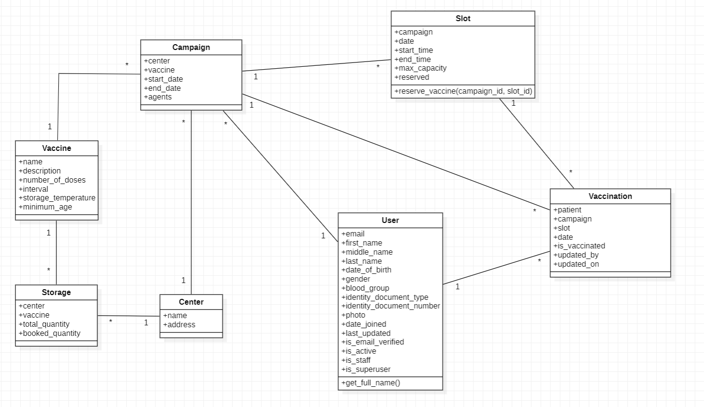

# Book My Vaccine - Vaccination Scheduling Application

## Introduction

Vaccination Scheduling System is utility software which helps the administrator, vaccination centers and users to schedule, organize, track and monitor mass vaccination. With the rise of number of infections and diseases, getting vaccinated has become important decision in order to maintain health. Vaccination Scheduling Application provides effective solution for administrations, vaccination center and patients from vaccination management to vaccination appointment. In this type of software, administrations can allocate, track and manage vaccine to vaccination center. Vaccination center can view, prepare and manage the incoming patients for vaccination. Whereas, the users can schedule and make an appointment for vaccination in the desired centers.

---

## Problem Statement

- To desgin a system where administrator can store vaccine, center and storage information.
- To design a system where administrator can create campaign, slots accross various centers.
- To design a system where user can view the center, campaign, slots, vaccine, center information.
- To design a system where user can schedule their vaccination and download their certificate after vaccination.

---

## Proposed Solution

This Vaccination Scheduling System consists of 7 main entities i.e., User, Vaccine, Center, Storage, Campaign, Slot and Vaccination. The admin will allocate vaccine to the center as well as assign agents to different centers along with their role and permissions. The health agents will be present in the vaccination center to take part in vaccination drive. They will be responsible to give vaccine to the patients, update the necessary information on the system and approve the vaccination. Patients can choose the vaccine type and book a slot in the desired vaccination center. Once, the vaccination is completed, patients can download the vaccination certification from the portal.

---

## Tools and Technology Used

The following tools and technologies are used to build this web application.

- Frontend: Bootstrap
- Backend: Django
- Database: Sqlite, Postgresql
- Testing: unit test, faker, factory boy
- Other libraries:
  - django-rosetta - for managing support for multiple languages
  - reportlab - for creating vaccine certificate

---

## UML Design

Here is the class diagram of Book My Vaccine - Vaccination Scheduling Application


## Architecture Description

In this application we have 7 different models and their description are as follows:
1. User : For storing information related to patient.
2. Vaccine : For storing vaccine information.
3. Center : For storing vaccination center information.
4. Storage : For storing vaccine storage information.
5. Campaign : For storing vaccination campaign details.
6. Slots : For storing slots of each campaign.
7. Vaccination : For storing vaccination appointments.

- The relationship between these models is shown in the above class diagram. We will utilize these models to give the interface to the user for performing CRUD Operations. 
---

## Expected Outcome

As a result of implementing this system, we shall expect a web application where patients can sign up and login to update their medical information and then apply for vaccination in their desired vaccination center at given date time. Whereas, admin shall login to their portal and then create some vaccination center and also create some agents of different types and deploy/assign them to the center. Admin shall create vaccine profile and allocate storage to the center and allow for conduction vaccination drive at different date and time. Whereas, the health agents which are assigned to the different vaccination center shall have different roles and permissions and based on that, they will perform some actions. They will be required to verify user and approve vaccination. Once vaccination is approved, user will be able to download the vaccination certificate.

## How to Run this Project - Using Docker

1. Clone this Repository

```
https://github.com/Prabin-Kumar-Baniya-NP/Vaccination-Scheduling-App.git
```

2. Build the docker image

```
docker image build -t bookmyvaccine:1.0 .
```

3. Run the container

```
docker container run -it -p 8002:8000 bookmyvaccine:1.0
```
